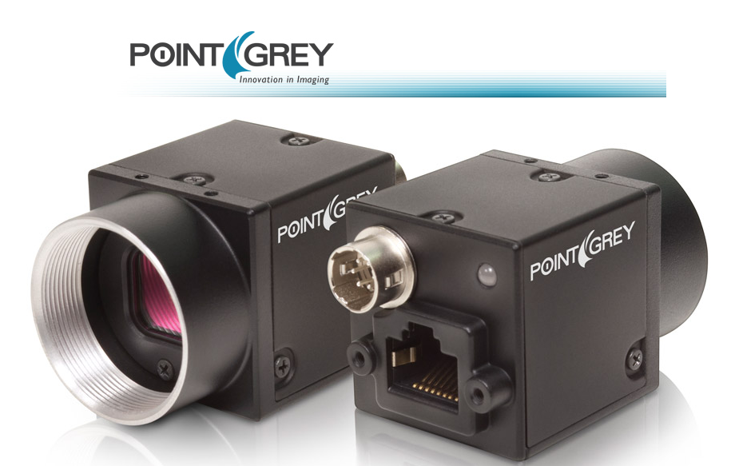

PointGrey
----------



Intoduction
```````````
Poiint Grey is a world-leading designer and manufacturer of innovative, high-performance digital cameras for industrial, life science, and traffic applications. We offer a unique and comprehensive portfolio of USB 3.0, GigE, FireWire, USB 2.0 and Camera Link products known for their outstanding quality, ease of use, and unbeatable price-performance. 

The Lima module as been tested only with this GigE cameras models:
  - Blackfly 1024x768 (model BFLY-PGE-05S2M)


Prerequisite
````````````
Previously to this you have to install the PointGrey *FlyCapture* SDK. We only tested it on debian6 and using 
the SDK version 2.3.19 (the latest one compatible with debian6 libc).

PointGrey python module need at least the lima core module.

Installation & Module configuration
````````````````````````````````````

-  follow first the steps for the linux installation :ref:`linux_installation`

The minimum configuration file is *config.inc* :

.. code-block:: sh

  COMPILE_CORE=1
  COMPILE_SIMULATOR=0
  COMPILE_SPS_IMAGE=1
  COMPILE_ESPIA=0
  COMPILE_FRELON=0
  COMPILE_MAXIPIX=0
  COMPILE_PILATUS=0
  COMPILE_POINTGREY=1
  COMPILE_BASLER=0
  COMPILE_CBF_SAVING=0
  export COMPILE_CORE COMPILE_SPS_IMAGE COMPILE_SIMULATOR \
         COMPILE_ESPIA COMPILE_FRELON COMPILE_MAXIPIX COMPILE_PILATUS \
         COMPILE_POINTGREY COMPILE_BASLER COMPILE_CBF_SAVING


-  start the compilation :ref:`linux_compilation`

-  finally for the Tango server installation :ref:`tango_installation`


Initialisation and Capabilities
````````````````````````````````
Implementing a new plugin for new detector is driven by the LIMA framework but
the developer has some freedoms to choose which standard and specific features will be make available. This section is supposed to give you good knowledge regarding camera features within the LIMA framework.


Camera initialisation
......................

The camera has to be initialized using the PointGreyCamera class. The default constructor needs at least the serial number of your camera in order to get the network connection setting up. 
In Addition one can provide both packate_size and packet_delay parameters. By default no value is passed.


Std capabilities
................

This plugin has been implement in respect of the mandatory capabilites but with some limitations which are due to the camera and SDK features.  We only provide here extra information for a better understanding of the capabilities for Andor cameras.

* HwDetInfo

 getPixelSize(): the method just returns -1, it has to be implemented in further version.
 get/setImageType(): the plugin only supports Bpp8 and Bpp16

* HwSync

 get/setTriggerMode(): Depending of the camera model, but some can not support any trigger mode. Otherwise the only implemented modes are IntTrig and ExtTrigSingle. IntTrigMult is normally a mandatory mode (for any camera) and will be implemented in next version.


Optional capabilities
........................

None has been implemented for this camera plugin.


Specific control parameters
.............................

Some specific paramaters are available within the camera hardware interface. Those parameters should be used carefully and one should refer to the camera SDK (or user's guide) documentation for a better understanding.

* get/setPacketSize()
* get/setPacketDelay()
* get/setGain()
* get/setAutoGain()
* getGainRange()

The following parameters can break the synchronisation with the LIMA HwSync layer by changing the camera internal exposure time.

* get/setAutoExpTime()
* get/setFrameRate()
* get/setAutoFrameRate()


Network Configuration
``````````````````````
- Depending on your network infrastructure you will need to configure a fix IP address for the camera or use a DHCP setup instead.

  The linux SDK  provides a configuation tool called *GiGEConfigCmd*. The Windows SDK version provides a graphical tool, *GigEConfigurator.exe* 

- Then in the PointGrey Tango device set the property *camera_serial* using the camera serial number (sticked on the camera).

- If you are running the server with linux kernel >= 2.6.13, you should add this line into *etc/security/limits.conf*. With this line, the acquisition thread will be in real time mode.

.. code-block:: sh

  USER_RUNNING_DEVICE_SERVER	-	rtprio	99

How to use
````````````
This is a python code example for a simple test:

.. code-block:: python

  from Lima import PointGrey
  from lima impor Core

  cam = PointGrey.Camera(13125072)
  hwint = PointGrey.Interface(cam)
  control = Core.control(hwint)

  acq = control.acquisition()

  # configure some hw parameters
  hwint.setAutoGain(True)
  hwint.se

  # setting new file parameters and autosaving mode
  saving=c.saving()

  pars=saving.getParameters()
  pars.directory='/buffer/lcb18012/opisg/test_lima'
  pars.prefix='test1_'
  pars.suffix='.edf'
  pars.fileFormat=Core.CtSaving.EDF
  pars.savingMode=Core.CtSaving.AutoFrame
  saving.setParameters(pars)

  # now ask for 10ms sec. exposure and 100 frames
  acq.setAcqExpoTime(0.01)
  acq.setNbImages(100) 
  
  acq.prepareAcq()
  acq.startAcq()
